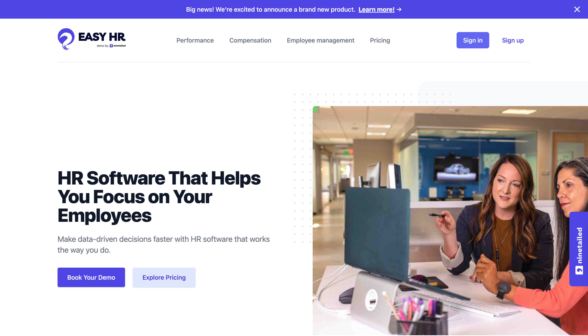

# Personalizations and Experiments with Ninetailed, Contentful, and Next.js



The illustrated website example demonstrates the Ninetailed content personalization integration for Contentful using Next.js as the web framework.

- [Live Demo](#live-demo)
- [Deploy Your Own Playground Without Code](#deploy-your-own-playground-without-code)
  - [Step 1. Create a Ninetailed Account](#step-1-create-a-ninetailed-account)
  - [Step 2. Create a Contentful Account and Space](#step-2-create-a-contentful-account-and-space)
  - [Step 3. Create Contentful API Credentials](#step-3-create-contentful-api-credentials)
  - [Step 4. Create Ninetailed API Credentials](#step-4-create-ninetailed-api-credentials)
  - [Step 5. Connect Ninetailed to Contentful](#step-5-connect-ninetailed-to-contentful)
  - [Step 6. Deploy As A Vercel Project](#step-6-deploy-your-personal-playground-on-vercel)
  - [Step 7. Final Remarks](#step-7-final-remarks)
- [Developer Section](#developer-section)
  - [Getting Started](#getting-started)
  - [Import and Export Data to Contentful](#import-and-export-data-to-contentful)

## Live Demo

This project is deployed live [here](https://examples-marekting-contentful-next-app-all-in.vercel.app/).

## Deploy Your Own Starter

### Step 1. Create a Ninetailed Account

- [Sign up for a Ninetailed account](https://app.ninetailed.io/account/sign-up).
- Hold onto the link [https://app.ninetailed.io](https://app.ninetailed.io) for your future reference. This is the Ninetailed dashboard.

### Step 2. Create a Contentful Account and Space

- If you don't have one, [sign up for a Contentful account](https://www.contentful.com/sign-up/).
- Next, create a new empty **space** from your Contentful admin.

### Step 3. Create Contentful API Credentials

> ⚠️ **HINT:** Save the created API credentials temporarily in a note or a separate file, as you will need to provide them in the last step.

- Within your Contentful space, navigate to the navigation bar, go to **Settings** and click on **API keys** in the dropdown.
- Click on **Add API key**.
- Enter a name for your API key.
- Determine which Contentful environment or environment alias you will use (NEXT_PUBLIC_CONTENTFUL_ENVIRONMENT) and enable their access on the API key (at the bottom)
  - In a new Contentful space, you will start with one environment called **master**.
  - You may also create your own environment and/or opt in to environment aliases; be sure to enable the API key to your environment or environment alias in the API key settings.
- Copy the following credentials for later use from the API key:

  - **Space ID** (NEXT_PUBLIC_CONTENTFUL_SPACE_ID)
  - **Content Delivery API - access token** (CONTENTFUL_TOKEN)
  - **Content Preview API - access token** (CONTENTFUL_PREVIEW_TOKEN)

- From the **Settings** menu, select the **CMA Tokens** link.
- Generate a **Personal Access Token** (CONTENTFUL_MANAGEMENT_TOKEN) using the "Create Personal Access Token" button in the upper right. This will be used to import the demo content model. Copy this token down immediately because it cannot not be shown again.

### Step 4. Gather Ninetailed API Credentials

> ⚠️ **HINT:** Save the created API credentials temporarily in a note or a separate file, as you will need to provide them in the last step.

- Within your Ninetailed account, click on **API Key** in the sidebar.
- Save the shown **API Key** (NEXT_PUBLIC_NINETAILED_CLIENT_ID) to your notes.
- Similar to Contentful, Ninetailed offers two self-sufficient working environments. You can choose to work in the 'main' or 'development' environment by selecting either one from the droptown in the upper left of the interface. Choose either one, then note down your choice of either `main` or `development` as your **Ninetailed Environment Name** (NEXT_PUBLIC_NINETAILED_ENVIRONMENT).

### Step 5. Install Ninetailed in Contentful

- Within the Ninetailed dashboard, select **Content Sources** in the left sidebar, then the **New Content Source** button in the upper right.
- Select **Contentful** as your CMS and click **Authenticate** on the following screen. Finally, click **Authorize** in the pop up dialogue.
- Select the space and environment or environment alias for which you created your Contentful API key in steps 2 and 3.
- Click **Create Content Source**. Ninetailed will add the necessary content types and the Ninetailed app to Contentful.

### Step 6. Deploy As A Vercel Project

- Click on **Deploy with Vercel** below and populate the required environment variables.

[](https://vercel.com/new/clone?repository-url=https%3A%2F%2Fgithub.com%2Fninetailed-inc%2Fninetailed-examples%2Ftree%2Fmain%2Fmarketing-contentful-next-app-all-in&env=NEXT_PUBLIC_NINETAILED_CLIENT_ID,NEXT_PUBLIC_NINETAILED_ENVIRONMENT,NEXT_PUBLIC_CONTENTFUL_SPACE_ID,NEXT_PUBLIC_CONTENTFUL_ENVIRONMENT,CONTENTFUL_TOKEN,CONTENTFUL_PREVIEW_TOKEN,CONTENTFUL_MANAGEMENT_TOKEN&project-name=ninetailed-marketing-contentful-next-app-all-in&repository-name=ninetailed-marketing-contentful-next-app-all-in&build-command=npm%20run%20build-and-setup)

```bash
NEXT_PUBLIC_NINETAILED_CLIENT_ID = "API Key" # Gathered in step 4
NEXT_PUBLIC_NINETAILED_ENVIRONMENT = "Ninetailed Environment Name" # 'main' or 'development', depending on your choice in step 4
NEXT_PUBLIC_CONTENTFUL_SPACE_ID = "Space ID" # Availabe by inspecting your API key created in step 3
NEXT_PUBLIC_CONTENTFUL_ENVIRONMENT = "Contentful Environment Name" # Default will be 'master' unless, from step 3
CONTENTFUL_TOKEN = "Content Delivery API - access token" # From API key created in step 3
CONTENTFUL_PREVIEW_TOKEN = "Content Preview API - access token" # From API key created in step 3
CONTENTFUL_MANAGEMENT_TOKEN= "Personal Access Token" # From Personal Access Token created in step 3
```

### Step 7. Final Remarks

If you intend to make changes to the source code and publish it in the future, you should first disable the build command override in the project settings on Vercel.\
Otherwise, the template content is populated with each build and eventually overwrites your changes in Contentful.

## Developer Quick Start

### Create and Install Ninetailed

Use our documentation [here](https://docs.ninetailed.io/setup/content-sources) to install Ninetailed to a blank Contentful environment.

### App Setup

Install all packages:

```bash
yarn install
```

Provide the required environment variables to your .env file:

```bash
NEXT_PUBLIC_NINETAILED_CLIENT_ID=XXXXXXXX-XXXX-XXXX-XXXX-XXXXXXXXXXXX
NEXT_PUBLIC_NINETAILED_ENVIRONMENT=main || development

NEXT_PUBLIC_CONTENTFUL_SPACE_ID=XXXXXXXXXXXX
NEXT_PUBLIC_CONTENTFUL_ENVIRONMENT=nameOfYourEnvironment

CONTENTFUL_TOKEN=XXXXXXXXXXXXX_XXXXXXXXXXXXXXXXXXXXXXXXXX_XX
CONTENTFUL_PREVIEW_TOKEN=XXXXXXXXXXXXXXXXXXXXXXXXXXXXXXXXXXXXXXXXXXX

CONTENTFUL_MANAGEMENT_TOKEN=XXXXX-XXXXX-XXXX-XXXXXXXXXXXXXXXXXXXXXXXXXXXXXXXX
```

### Import Demo Data to Contentful

```bash
yarn setup
```

### Develop

Run the development server:

```bash
yarn dev
```

### Make Your Own Content Export

```bash
yarn export
```

### Generate Types

```bash
yarn codegen
```
